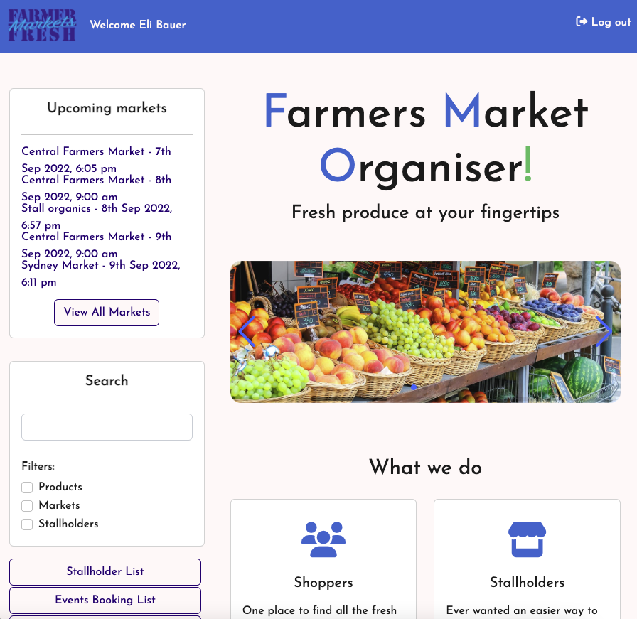

# Farmers Market Organiser

  ## Description
  
  
  
  This application will provide organisational services to companies that conduct Farmers Market operations. It will allow them to organise the rental of their stores online and utilise their clients' details to help inform the general public and help advertise the markets.

[https://farmers-market-organiser-app.herokuapp.com/](https://farmers-market-organiser-app.herokuapp.com/) 
 
  ## Table of Contents
  
  - [Installation](#installation)
  - [Usage](#usage)
  - [Credits](#credits)
  - [License](#license)
  - [Features](#features)
      - [Contributions](#contributions)
  - [Tests](#tests)
  - [Questions](#questions)
      - [Contacts](#contacts)
  
  ## Installation
   
  Installation Instructions:
- Clone/fork from github repository https://github.com/rschragger/Farmers-Market-Organiser/
- Run `npm install` to install all node modules
-  Run `npm run seeds` if you require seeding of the database
-  Run `npm start` to start running the application

  
  ## Usage
   
  Usage Instructions:
- Go to deployed location in your browser
- Users can search, eplore and interact with the website
- Signup and login to administer a market or to administer a stall, to advertise your product and book at market events

  
  ## Credits
   
 #### Collaborators
- Sean Genge
- Nancy Mile
- Reeve Schragger

####   Languages
- HTML
- CSS
- JavaScript
- MySQL
- NodeJs

  
####   Third Party Assets
- bCrypt
- connect-session-sequelize
- dotenv
- expressjs
- express-handlebars
- express-session
- bootstrap
- mysql2
- nodemon
- sequelize
- multer
- validator
- swiper
- mockaroo.com
- momentjs

  
####   Tutorials
- stack overflow
- sequelize.org
- w3Schools 
- documentation from each technology used

  
  ## License
   
  This application is licensed under Creative Commons

  CC0
  
  ## Features
  - Please see presentation at https://docs.google.com/presentation/d/1yFOVaY0zANTY05HVmSNk55MZ4g-kL4LGhfnJW1tMnd4/edit?usp=sharing
  - Different logins and capabilities for organiser and stallholder
  - Shopper has a rich un-logged experience
  - Complex booking made easy for stallholders
  - Easy to configure, update and customise experience for your clients, including upload of images and additions to database

  
  ## Contributions
   
  Contribution guidelines: Consult with organising group listed in contributors
  

  
  ## Questions
   

  
  ### Contacts
   
  You can reach us for additional questions at:
  - Email: [reeveschragger@gmail.com](mailto:reeveschragger@gmail.com)

  - GitHub: 
   - [Farmers Market Organiser](https://github.com/rschragger/Farmers-Market-Organiser/)
   - [Reeve Schragger](https://github.com/rschragger/)
   - [Sean Genge](https://github.com/SeanGenge)
   - [NancyMile](https://github.com/NancyMile)
  
  

  &copy; Copyright 2022 Farmers Market Organising Group

  
